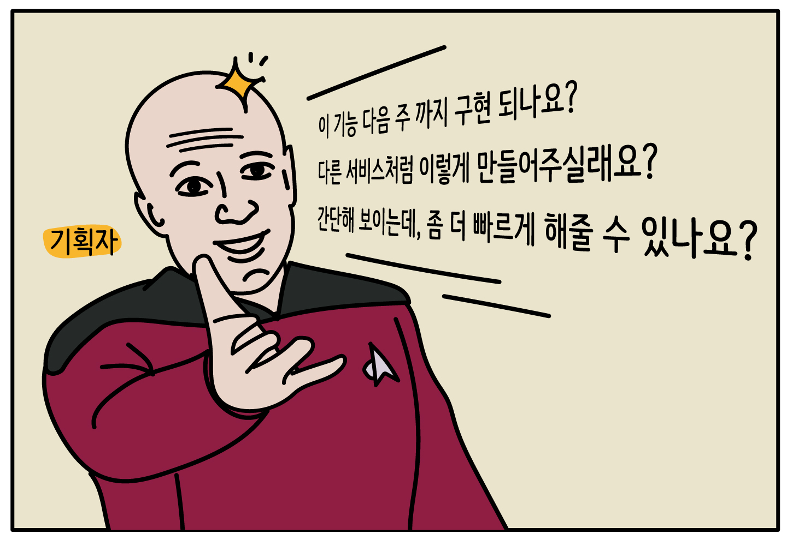
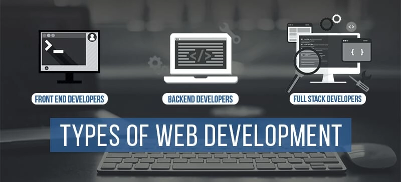

> '이거 오늘 배포 가능하죠?
>
> 💢 개발자들: "🤬"
>
> SD-UI: "네, 가능합니다."

팀워크 강화와 야근 퇴치의 필수 기술, Server Driven UI 적용기 지금부터 시작해보자.

# Server Driven UI 적용기

## What is the Server Driven UI?

본투비 철학도인지라, 우선 그 명칭부터 짚고 넘어가자. Server Driven UI 라고 하면 A user interface controlled by the server 라고 나름 변환해 볼 수 있겠는데, 
요컨데 '서버가 주도하는 UI'를 통칭한다고 할 수 있겠다.



그런데 서버가 UI를 변환한다는게 뚱딴지같다. 

현 시점에서 통상적인 개발 범위는 화면 단을 다루는 프론트엔드 개발자이냐 혹은 데이터를 다루는 백엔드 개발자이냐 둘 중 하나로 나눠지고 있는데, 이 와중에 서버에서 UI를 보내준다는건 어떤 의미인가? 백 번 양보해서 서버가 UI를 처리하더라도, 복잡한 단계의 디자인은 어떻게 처리를 하라는 이야기일까? 


[//]: # (![img_2.png]&#40;img_2.png&#41;)

## 그.. 왜 하는 거야?

눈을 감고 머리속에서 간단한 시뮬레이션을 돌려보자. 
만약 12월 12일 자정까지만 이벤트 이미지를 사용해야 하고, 그 이후로는 다른 이미지를 띄워야 한다고 가정해보자. 코드는 단순하게 아래와 같이 짤 수 있을 것이다.

```
import React from 'react';

const EventBanner: React.FC = () => {
  const now = new Date();
  const eventDeadline = new Date('2024-12-12T00:00:00'); // 12/12 자정

  const bannerSrc = now < eventDeadline ? 'eventOngoing' : 'eventFinished';

  return (
    
  );
};

export default EventBanner;
```

그렇게 되면, Date로 비교하는 조건문이 사용되지 않는 코드이니, 12월 12일 자정 이후 이 코드를 또 수정해야 한다. (하지만 높은 확률로 위의 코드에서 레거시 코드가 된다..)

```
import React from 'react';

const EventBanner: React.FC = () => {
  return (
    
  );
};

export default EventBanner;

```


자정이 지나면, 사용자의 디바이스에 알맞는 이미지가 노출되기 때문에 요구사항에 잘 맞는 코드인 것 처럼 보인다. 하지만 과연 그럴까? 만약 이벤트 참여자 수가 너무 저조해서 12월 12일 자정이 아니라, 12월 20일 오후 6시로 수정되었다면?

우리는 눈물을 머금고 다시 코드를 수정해야 한다. 이 자그마한 수정사항을 위해서 다시 배포와 검수 과정을 다시 거쳐야 한다. 

이러한 구조는 빠르고 유연하게 변하는 비즈니스 로직에 대응하기에 적합하지 않은 구조이다. 코드 레벨에 제한되어 있다면, 비즈니스 요구사항에 맞춰야 하는 기획자 혹은 사용자의 수요에 대응하기가 어렵다. 이와 같은 어려움을 겪은 경험이 있다면, SD-UI의 도입은 적합한 해결책이 될 수 있다.

## SD-UI 를 어디에 적용할 수 있는데?

방금 잠시 언급했던 예시처럼, 단순 반복 작업이 계속되었던 이벤트 페이지가 가장 적합하지 않을까 싶었다. 

만약 신규 이벤트를 만들어야 하는 상황이라고 생각해보자. 우리는 그 동안 신규 이벤트를 개발하기 위해서 다음과 같은 공수를 반복적으로 작업해야 했다. 

(기존 이벤트 페이지 이미지)

- 비슷한 Layout과 Style을 기존 이벤트 페이지에서 가져오기
- 스타일 수정 등 간단한 작업에도 배포 공수 소모
- 이미지 재배포하기


## 얼마나 효과적이게 공수를 줄일 수 있는데?
- 기간 변경/특정 유저에게 다른 UI 제공 

- 이러한 케이스의 경우
- 기존의 경우 :
- SD-UI 적용하였을 경우 : 

[//]: # (간단한 업무는 자동화를 시킴으로, 무의미한 반복노동을 줄일 수 있습니다.)

[//]: # ()
[//]: # (또한 기획자의 요구를 즉각적으로 받아들여, 빠른 배포 프로세스를 가질 수 있습니다.)

## 반영 내용

SD-UI를 도입하면서 데이터 뿐 아니라 디자인 정보도 서버가 함께 내려주게 됩니다.

예시를 들어볼까요?

```typescript
return {
  resultCode: 'SUCCESS',
  resultMessage: '성공',
  totalCount: 80,
  row: 2,
  column: 4,
  collection: [
    {
      franchiseCode: 46,
      franchiseName: '던킨',
      franchiseLogo:
        'https://imgs.albamon.kr/images/franchise_booth/46/MBrandMain_Logo.gif',
      keywordCode: '1080001',
      keywordName: '',
      partCode: '1080',
      partName: '',
    },
    {
      franchiseCode: 47,
      franchiseName: 'CJ 올리브영',
      franchiseLogo:
        'https://imgs.albamon.kr/images/franchise_booth/47/MBrandMain_Logo_1.gif',
      keywordCode: '2060016',
      keywordName: '',
      partCode: '2060',
      partName: '',
    },
  ],
};
```

다음의 데이터를 받아서, 다음과 같은 화면을 구성할 수 있습니다.

(이미지)

data.row, data.column 을 통해 row, column으로 이루어진 표의 레이아웃을 변경할 수 있습니다.

데이터 변경 후, 실제 배열이 변경된 것을 확인할 수 있습니다.

(이미지)

과거 행과 열이 클라이언트에 박혀있었기 때문에, 배열을 바꾸려면 클라이언트 수정이 필요했습니다.
하지만, SD-UI를 통한다면, 클라이언트 수정 없이 서버의 응답 값만 바꾸는 것 만으로 자유롭게 레이아웃을 조정할 수 있습니다.


## 사용 기술


## 폴더 구조


## 마치며