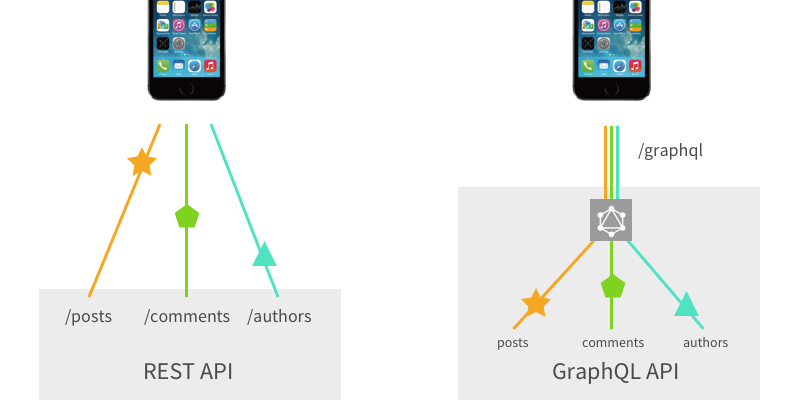

> '이거 오늘 배포 가능하죠?
>
> 💢 개발자들: "🤬"
>
> SD-UI: "네, 가능합니다."

팀워크 강화와 야근 퇴치의 필수 기술, Server Driven UI 적용기 지금부터 시작해보자.

# Server Driven UI 적용기

## What is the Server Driven UI?

본투비 철학도인지라, 우선 그 명칭부터 짚고 넘어가자. Server Driven UI 라고 하면 A user interface controlled by the server 라고 나름 변환해 볼 수 있겠는데, 
요컨데 '서버가 주도하는 UI'를 통칭한다고 할 수 있겠다.


그런데 서버가 UI를 변환한다는게 뚱딴지같다. 

현 시점에서 통상적인 개발 범위는 화면 단을 다루는 프론트엔드 개발자이냐 혹은 데이터를 다루는 백엔드 개발자이냐 나눠진다고들 하는데, 이 와중에 서버에서 UI를 보내준다는건 어떤 의미인가? 백 번 양보해서 서버가 UI를 처리하더라도, 복잡한 단계의 디자인은 어떻게 처리를 하라는 이야기일까? 

[//]: # (![img_2.png]&#40;img_2.png&#41;)

## 그.. 왜 하는 거야?

눈을 감고 머리속에서 간단한 시뮬레이션을 돌려보자. 
만약 12월 12일 자정까지만 이벤트 이미지를 사용해야 하고, 그 이후로는 다른 이미지를 띄워야 한다고 가정해보자. 코드는 단순하게 아래와 같이 짤 수 있을 것이다.

```
import React from 'react';

const EventBanner: React.FC = () => {
  const now = new Date();
  const eventDeadline = new Date('2024-12-12T00:00:00'); // 12/12 자정

  const bannerSrc = now < eventDeadline ? 'eventOngoing' : 'eventFinished';

  return (
    
  );
};

export default EventBanner;
```

그렇게 되면 Date로 비교하는 조건문이 사용되지 않는 코드이니, 12월 12일 자정 이후 이 코드를 또 수정해야 하는 불상사가 벌어진다. (하지만 높은 확률로 수정되지 않고 레거시 코드가 된다..)

```
import React from 'react';

const EventBanner: React.FC = () => {
  return (
    
  );
};

export default EventBanner;

```


코드의 수정 여부를 떠나서 어찌되었든 자정이 지나면 사용자의 디바이스에 알맞는 이미지가 노출되기 때문에 요구사항에 얼추 들어맞는 코드인 것 처럼 보인다. 하지만 과연 그럴까? 만약 이벤트 참여자 수가 너무 저조해서 12월 12일 자정이 아니라, 12월 20일 오후 6시로 수정되었다면?

우리는 눈물을 머금고 다시 코드를 수정해야 한다. 이 자그마한 수정사항을 위해서 다시 배포와 검수 과정을 다시 거쳐야 한다. 

이러한 구조는 빠르고 유연하게 변하는 비즈니스 요구사항에 대응해야 하는 기획자 혹은 사용자의 수요에 대응하기가 어렵다. 이와 같은 어려움을 겪은 경험이 있다면, SD-UI의 도입은 적합한 해결책이 될 수 있다.


## [본론 1] 어떻게 적용하는데?

Server Driven UI 를 구현하기 위한 대표적인 기술 Stack으로 graphql, Apollo를 톱아볼 수 있겠다. 차차 살펴보겠지만, SD-UI의 핵심 요구사항이라고 할 수 있는 유연한 데이터 요청, 실시간 데이터 업데이트, 구조화된 UI 데이터 제공을 효과적으로 충족시키기 때문이다.
<!-- 다른 기술과의 비교 -->


#### What is GraphQL?
먼저 GraphQL에 대한 정의부터 필요하겠다. 이해가 쉽도록 살짝 비교해서 설명하자면, GraphQL(이하 gql)은 sql과 마찬가지로 쿼리 언어다. 다만 차이가 있다면 gql과 sql의 언어적 구조 차이와 사용 목적에 있다. 이 방식이 활용 측면에서 차이를 가져왔다고도 할 수 있다. sql의 목적은 데이터베이스 시스템에 저장된 데이터를 효과적으로 가져오는 것이고, gql은 웹 클라이언트가 데이터를 서버로부터 효율적으로 가져오는 것에 그 목적이 있다.

#### 데이터 요청 최적화: GraphQL의 Over-fetching & Under-fetching 문제 해결



gql은 아무래도 그 개념적 정의로 인하여 종종 REST API와 비교 선상에 놓이기도 한다. 가장 큰 차이 중 하나는 Endpoint에 대한 것이다. REST API는 URL, METHOD등을 조합하기에 다양한 EndPoint가 존재하는 반면, gql에서는 단 하나의 endpoint가 존재한다. gql은 API에서 불러오는 데이터의 종류를 쿼리 조합을 통해서 결정한다는 것인데, 이 말인 즉슨 REST API의 단점인 Over-fetching 및 Under-fetching 문제를 해결할 수 있다는 뜻이다.

약간의 부연설명을 덧붙이자면, 기존 REST API는 필요한 데이터만 정확하게 가져오기가 어려웠다. 필요 없는 데이터를 가져오는 Over-fetching이나 하나의 api로는 불충분해 여러 네트워크 호출이 필요했던 Under-fetching이 빈번하게 발생했는데, gql은 필요한 데이터만 요청하거나 쿼리 하나로 여러 데이터를 조합해 가져와 앞서 언급한 REST API의 이슈를 해결할 수 있다.

예를 들어, 사용자의 이름과 주소를 가져와야 한다고 가정해보자. REST API는 사용자 정보를 가져오는 `/users/123`, 사용자 주소를 가져오는 `/users/123/address`를 호출해야 할 수 있다. 해당 경우 gql은 단일 Endpoint를 이용하여 필요한 데이터만 조합하여 요청하면 된다.

```graphql
query {
  user(id: 123) {
    name
    address {
      street
      city
    }
  }
}

```

<!-- #### UI 구성 데이터를 위한 GraphQL의 Fragment 사용

GraphQL의 재사용 가능한 필드 묶음인 Fragment는 UI 컴포넌트를 정의하고, 관리하는데 적합하다.
클라이언트는 Fragment를 사용해 요청 시 서버에서 사용 가능한 모든 UI 컴포넌트를 명시할 수 있다.

```graphql
fragment ComponentFields on Component {
  id
  type
  props
}

query GetComponents($eventId: ID!) {
  getEventPageComponents(eventId: $eventId) {
    components {
      ...ComponentFields
    }
  }
}
``` -->

#### What is Apollo?
앞서 이러쿵 저러쿵 장점을 나열했지만 gql 자체는 쿼리 언어다. 다시 말해 명세이자 형식일 뿐 이 자체만으로는 딱히 할 수 있는게 없다. 따라서 gql을 실제 구체적으로 활용할 수 있도록 도와주는 솔루션이 필요하다. 여기에는 graphQL yoga, Relay 등 여러 라이브러리가 존재하는데, 우리의 경우 러닝커브가 낮고, 가장 사용 점유율이 높은 Apollo를 선택하였다. Apollo는 백엔드와 프론트엔드를 모두 제공하며, 사용법이 간단하다는 장점이 있다.


어떻게 적용하는지 확인하기 위해 아래 예시 코드를 보자.

#### 스키마 정의
```typescript
const { gql } = require("apollo-server");

const typeDefs = gql`
  scalar JSON // JSON 데이터를 다룰 수 있는 커스텀 타입

  enum ComponentType { // 컴포넌트 종류
    TITLE
    FLOATING_BUTTON
  }

  type Component {  // 각 컴포넌트의 속성
    type: ComponentType!
    text: String
    width: String
    height: Int
    onClick: String
  }

  type ComponentResponse {  // 서버가 반환하는 데이터 구조
    resultCode: String!
    resultMessage: String!
    eventId: ID!
    components: [Component!]!
  }

  // 클라이언트가 호출할 수 있는 API
  type Query {  
    getEventPageComponents(eventId: ID!): ComponentResponse!
  }
`;
```

클라이언트와 서버 간의 스키마 약속은 typeDef에서 정의한다. gql 명세에서 사용될 데이터의 구조와 요청 타입을 나타낸다.

#### 비즈니스 로직
```typescript
const resolvers = {
  Query: {
    getEventPageComponents: async (_, { eventId }) => {
      return {
        resultCode: "SUCCESS",
        resultMessage: "성공",
        eventId,
        components: [    // 이벤트 페이지에 필요한 컴포넌트 리스트
          {
            type: "TITLE",
            text: "이벤트 제목",
            width: "100%",
            height: 50,
            onClick: "handleTitleClick",
          },
          {
            type: "FLOATING_BUTTON",
            text: "참여하기",
            width: "80%",
            height: 47,
            onClick: "handleButtonClick",
          },
        ],
      };
    },
  },
};
```

resolver는 비즈니스 로직으로, 서버에서 데이터를 반환하거나 입력, 수정, 삭제하는 CRUD에 대한 액션들을 함수 형태로 지정한 것이다. 클라이언트가 getEventPageComponents API를 호출하면 실행된다.

#### 서버 설정
```typescript
const { ApolloServer } = require("apollo-server");

const server = new ApolloServer({
  typeDefs,  // 스키마 정의
  resolvers, // 데이터 처리 로직
  plugins: [
    require("apollo-server-core").ApolloServerPluginLandingPageGraphQLPlayground(),
  ],
});

const PORT = 4000;

server.listen({ port: PORT }).then(({ url }) => {
  console.log(`🚀 GraphQL 서버가 실행 중입니다: ${url}`);
});
```
Apollo Server를 사용하여 gql을 실행한다. new 연산자로 ApolloServer 객체를 만드는데, 이 객체는 typeDef와 resolvers를 매개 변수로 받아 해당 서버 객체의 listen()을 호출하여 url을 매개 변수로 넣어 실행한다.

이제 Client에서 아래와 같은 쿼리를 호출하여 데이터를 받아올 수 있다.

```typescript
query {
  getEventPageComponents(eventId: "123") {
    resultCode
    resultMessage
    eventId
    components {
      type
      text
      width
      height
      onClick
    }
  }
}
```

#### ApolloClient

```typescript
import { ApolloClient, InMemoryCache } from '@apollo/client';

// Apollo Client 설정
export const client = new ApolloClient({
  uri: 'https://albamon-sd-ui.onrender.com/',  // GraphQL 서버의 주소
  cache: new InMemoryCache(),            // 데이터를 효율적으로 관리하기 위한 캐시
});
```
ApolloClient는 GraphQL 서버와의 통신을 관리하는 도구로, Axios 같은 역할이라고 이해하면 편할 것이다. uri에는 gql 서버의 주소를, cache는 필요 이상으로 정보 다루지 않도록 InMemoryCache를 통한 캐시 관리를 담당하고 있다.

다음과 같이 ApolloProvider 로 감싸면 정상적으로 데이터를 가져올 수 있다.

```typescript
function MyApp({ Component, pageProps }) {
  return (
    <ApolloProvider client={client}>
      <Component {...pageProps} />
    </ApolloProvider>
  );
}
```
 

<!-- #### 실시간 데이터 업데이트: Subscriptions 구현

SD-UI는 실시간 변경사항 반영이 중요한데,
GraphQL의 서버의 특정 이벤트를 구독할 수 있는 Subscriptions 기능과 Apollo Server를 활용하여 
실시간 데이터 업데이트를 구현할 수 있다.

```graphql
subscription OnComponentAdded($eventId: ID!) {
  componentAdded(eventId: $eventId) {
    id
    type
    props
  }
}
```
새로운 컴포넌트 추가가 되면, resolvers를 활용하여 실시간 요구사항을 충족할 수 있다. 

```javascript
const { PubSub } = require('graphql-subscriptions');
const pubsub = new PubSub();

const resolvers = {
  Subscription: {
    componentAdded: {
      subscribe: (_, { eventId }) => pubsub.asyncIterator(`COMPONENT_ADDED_${eventId}`),
    },
  },
};
```

GraphQL 지원이 최적화되어 있다는 것 또한 언급할만한 선정 이유이다. -->


## [본론 2] 그래서 SD-UI 를 어디에 적용할 수 있는데?

지금까지 SD-UI를 실제로 어떻게 구현하는지에 대한 방법론적인 이야기를 했다. 이제부터는 어디에 적용해야 효율적인지에 대한 이야기를 꺼내보자. 우리 서비스를 돌아보며 조건을 톺아 보도록 하자.

Server에서 UI 정보가 넘어오는 것 만큼, 지나치게 동적 로직 보다는 정형화된 Component가 사용되어야 한다. 또한 우리의 목적은 단순 반복 공수를 줄이는 데에 있으므로 간단한 작업이 반복해서 들어가는 페이지어야 한다. 빠르게 변하는 비즈니스 요구사항들을 신속하게 반영함으로 시장의 요구에 적합하게 대응할 수 있는 페이지면 더 좋겠다.  

이러한 조건을 늘어놓고 판단하자면, 이벤트 페이지가 가장 적합했다.
우리는 매 신규 이벤트가 반복될 때 마다 다음과 같은 작업이 필요했다.


- 비슷한 Layout과 Style을 기존 이벤트 페이지에서 수령
- 스타일 수정 등 간단한 작업에도 배포 공수 소모
- 이미지 변경 시 재배포 필요

이 잔잔바리 작업들을 개발자가 아니라 Server에서 가져온다면, 
정형화된 Style 값을 api에서 가져올 수 있다면 
개발자는 더욱 더 개발에만 집중할 수 있지 않을까?  

## [본론 3] 어떻게 공수를 줄일 수 있는데?


서버에서 Button Component 를 Client에 그리고자 할 때, 이 버튼을 그리기 위해서 어떠한 정보들이 필요할까? color, text 등 눈에 보이는 정보들 외에도, 버튼 클릭시 실행되어야 할 이벤트의 type도 받아올 수 있겠다.
그렇다면 스키마 명세는 다음과 같다.

| 속성            | 타입           | 설명           |
|----------------|--------------|--------------|
| type           | "BUTTON"     | 컴포넌트 타입  |
| text           | string       | 버튼 텍스트     |
| onClick        | string       | 클릭 핸들러 이름 |
| width          | string       | 버튼 너비       |
| height         | number       | 버튼 높이       |
| color          | string       | 텍스트 색상     |
| buttonColor    | string       | 버튼 색상       |
| backgroundColor| string       | 배경색         |
| fontSize       | number       | 폰트 크기       |
| fontWeight     | string       | 폰트 두께       |
| borderRadius   | string       | 테두리 둥글기   |
| borderColor    | string       | 테두리 색상     |
| borderWidth    | number       | 테두리 두께     |


Button Component 의 예시를 실제 코드로 작성해보자.
서버에서는 아래와 같이 데이터를 뿌려주고 있다. 

현재 화면에서 보여주고자 하는 Component들의 정보를 collection의 배열로 보내고 있다. 각 type을 지닌 Component 들의 순서를 서버에서 제어하여,
노출하고 싶은 UI를 조정할 수 있다. 

또한 우리는 CSS의 여러 복잡한 속성을 데이터에서 나태내고 싶었고, 그 결과 children 속성을 이용하여 Flex 패턴을 유연하게 구현해보고자 했다.
아래 예시의 IMAGE_WITH_CHILDREN Component는 children으로 IMAGE Component와 Button Component 를 자식으로 두고 있는 것을 확인할 수 있다.


```typescript
return {
  resultCode: 'SUCCESS',
  resultMessage: '성공',
  totalCount: 80,
  row: 2,
  column: 4,
  collection: [
      {
          type: "IMAGE_WITH_CHILDREN",
          backgroundColor: "#ff7e1d",
          paddingTop: 24,
          paddingLeft: 24,
          paddingRight: 24,
          children: [
              {
                  type: "IMAGE",
                  backgroundColor: "#fff",
                  width: "100%",
                  paddingTop: 30,
                  paddingBottom: 30,
                  paddingLeft: 24,
                  paddingRight: 24,
                  imageUrl:
                      "https://mts17-mc.albamon.kr/monimg/msa/assets/images/events/campusBattle/share_top.png",
              },
              {
                  type: "BUTTON",
                  onClick: "handleKakaoShareClick",
                  width: "100%",
                  height: 46,
                  text: "카카오톡으로 공유하기",
                  color: "#ffffff",
                  buttonColor: "#000000",
                  backgroundColor: "#fff",
                  fontSize: 16,
                  fontWeight: "700",
                  borderRadius: "8px",
                  paddingLeft: 24,
                  paddingRight: 24,
                  paddingBottom: 30,
              },
          ],
      },
  ],
};
```

Client단에서 화면의 정보를 받아 사전에 지정해 둔 Component type에 매칭되는 Component를 매핑시켰다.

```typescript
const MAPPED_COMPONENTS = {
    TITLE: Title,
    IMAGE_WITH_CHILDREN: ImageWithChildren,
    GROUP: Group,
    IMAGE: Image,
    BUTTON: Button,
    SPLIT: Split,
    CAROUSEL: Carousel,
    FLOATING_BUTTON: FloatingButton,
    FOOTER: Footer,
    LIST: List,
};
```

앞서 children 속성을 언급한 적이 있다.
Client 단에서 해당 속성이 있을 경우, 재귀적으로 컴포넌트를 호출하게끔 하여 복잡한 CSS Flex 패턴을 구현하게 하였다.

```typescript
const RenderComponent = (data) => {
    if (!data?.type) return null;

    const Component = MAPPED_COMPONENTS[data.type];
    if (!Component) return null;

    return (
        <Component {...data}>
            {data.children?.map((child, index) => (
                <RenderComponent key={`${child.type}_${index}`} {...child} />
            ))}
        </Component>
);
};

export const EventTemplate = () => {
    const {
        data: eventList,
    } = useQuery(GET_EVENT_LIST, {
        variables: { eventId: '1' },
    });

    return (
        <div className={cx(rootClass)}>
            <DefaultLayout>
                {eventList.getEventPageComponents.components.map((item, index) => (
                        <RenderComponent key={`${item.type}_${index}`} {...item} />
        ))}
            </DefaultLayout>
            </div>
);
};

```

만약 이미지가 변경된다면, 따로 FE 소스를 수정할 필요 없이 서버에서만 이미지 url을 수정하면 된다.

```typescript
{
                  type: "IMAGE",
                  backgroundColor: "#fff",
                  width: "100%",
                  paddingTop: 30,
                  paddingBottom: 30,
                  paddingLeft: 24,
                  paddingRight: 24,
                  imageUrl:
                      "https://mts17-mc.albamon.kr/monimg/msa/assets/images/events/campusBattle/share_top.png",
              }
```

서버에서 의도한 대로, 2개의 Component가 하나의 부모 Component안에 잘 배치되어 있다. 


#### Actions

단순히 화면에 보이는 값 뿐 아닌, Event handling의 경우에는 어떻게 할까?
버튼 이벤트의 경우에도 서버에서 미리 내려오는 onClick 값을 이용하면 복잡한 로직의 함수도 Client 단에서 핸들링 할 수 있다.

```typescript

interface HandlerMap {
    [key: string]: EventHandler;
}

const handlerMap: HandlerMap = {
    handleImageGroupClick: () => {
        alert('Image group clicked');
    },
    handleFloatingButtonClick: () => {
        alert('Floating button clicked');
    },
    handleKakaoShareClick: () => {
        alert('Kakao share clicked');
    },
    handleImageDownload: () => {
        alert('Image download clicked');
    },
    handleTextCopy: () => {
        alert('Text copy clicked');
    },
};

export const mapHandlerName = (handlerName: string): EventHandler => {
    return (
        handlerMap[handlerName] ||
        (() => console.warn(`Handler ${handlerName} not found`))
    );
};


// mapHandlerName 사용 예시
<button
    style={{
    width,
        height,
        color,
        backgroundColor: buttonColor,
        borderRadius,
        border: 0,
        borderWidth,
}}
onClick={mapHandlerName(onClick)}
    >
    {text}
    </button>

```


## 마치며 : 앞으로의 과제

View를 구성하는 정보를 서버에서 받아온다는 생각은 꽤 인상적인 접근법이다.
더불어 번거롭게 여러번 작업해야 했던 일들을 줄여준다면, 우리에게는 분명 환영할 만한 일이다.

한편, 모든 기술이 그렇듯이 Server Driven UI도 문제점 또한 있다. 
아주 복잡하거나 동적인 UI는 서버에서 가져오기 까다롭기 때문에, 결국엔 FE에서의 수정이 필요하다. 
이 기술은 그러니까, 아주 단순하고 반복적인 작업에 적합하게 보이기도 한다.
(물론 어떻게 사용하는지에 따라 다른 결과를 가져오겠지만)

어디에서 화면이 어떻게 그려지는지 코드 레벨에서 파악하기 어렵다는 단점 또한 언급할만 하다. 
JSON으로 내려오는 데이터만으로는 실제로 화면에 반영이 어떻게 되는지는 직관적으로 와닿지 않는다. 

다만, 단점이 없는 기술은 없기에 항상 더 중요한 것은 단점을 인지하는 시야와 대안이다. 
따라서 우리는 앞으로 이와 같은 과제를 해결해보려 한다. 

1. UI-Template 만들기
: 요컨데 특정 필요 페이지에 한하여 사전에 협업 부서와 변경 가능한 UI-Template를 정의해둘 수 있다.
이를 이용한다면, 충분히 요구사항을 충족할 수 있지 않을까?


2. 미리보기 VIEW 만들기
: 관리자 페이지를 만들어 개발자 이외 직군이 바로 변경사항을 입력할 수 있게 만들고,
데이터를 입력하는 즉시 관리자 내부 미리보기 VIEW 등을 만든다면 UI 반영 또한 예상할 수 있을 것이다.


앞으로 이러한 과제들을 해결해가면서, SD-UI프로젝트를 조금 더 발전시켜 가고자 한다.
