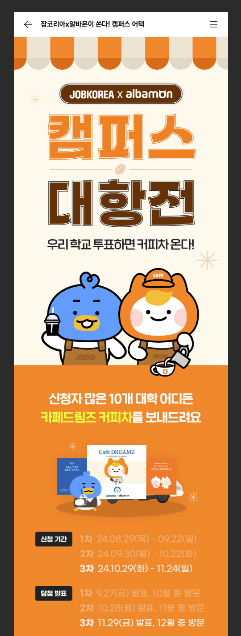
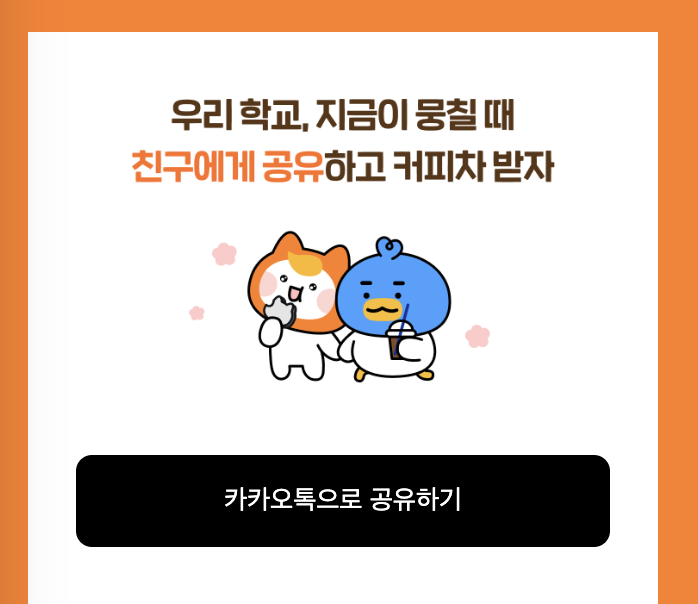

> '이거 오늘 배포 가능하죠?
>
> 💢 개발자들: "🤬"
>
> SD-UI: "네, 가능합니다."

팀워크 강화와 야근 퇴치의 필수 기술, Server Driven UI 적용기 지금부터 시작해보자.

# Server Driven UI 적용기

## What is the Server Driven UI?

본투비 철학도인지라, 우선 그 명칭부터 짚고 넘어가자. Server Driven UI 라고 하면 A user interface controlled by the server 라고 나름 변환해 볼 수 있겠는데, 
요컨데 '서버가 주도하는 UI'를 통칭한다고 할 수 있겠다.


그런데 서버가 UI를 변환한다는게 뚱딴지같다. 

현 시점에서 통상적인 개발 범위는 화면 단을 다루는 프론트엔드 개발자이냐 혹은 데이터를 다루는 백엔드 개발자이냐 나눠지고 있는데, 이 와중에 서버에서 UI를 보내준다는건 어떤 의미인가? 백 번 양보해서 서버가 UI를 처리하더라도, 복잡한 단계의 디자인은 어떻게 처리를 하라는 이야기일까? 

[//]: # (![img_2.png]&#40;img_2.png&#41;)

## 그.. 왜 하는 거야?

눈을 감고 머리속에서 간단한 시뮬레이션을 돌려보자. 
만약 12월 12일 자정까지만 이벤트 이미지를 사용해야 하고, 그 이후로는 다른 이미지를 띄워야 한다고 가정해보자. 코드는 단순하게 아래와 같이 짤 수 있을 것이다.

```
import React from 'react';

const EventBanner: React.FC = () => {
  const now = new Date();
  const eventDeadline = new Date('2024-12-12T00:00:00'); // 12/12 자정

  const bannerSrc = now < eventDeadline ? 'eventOngoing' : 'eventFinished';

  return (
    
  );
};

export default EventBanner;
```

그렇게 되면, Date로 비교하는 조건문이 사용되지 않는 코드이니, 12월 12일 자정 이후 이 코드를 또 수정해야 한다. (하지만 높은 확률로 위의 코드에서 레거시 코드가 된다..)

```
import React from 'react';

const EventBanner: React.FC = () => {
  return (
    
  );
};

export default EventBanner;

```


자정이 지나면, 사용자의 디바이스에 알맞는 이미지가 노출되기 때문에 요구사항에 잘 맞는 코드인 것 처럼 보인다. 하지만 과연 그럴까? 만약 이벤트 참여자 수가 너무 저조해서 12월 12일 자정이 아니라, 12월 20일 오후 6시로 수정되었다면?

우리는 눈물을 머금고 다시 코드를 수정해야 한다. 이 자그마한 수정사항을 위해서 다시 배포와 검수 과정을 다시 거쳐야 한다. 

이러한 구조는 빠르고 유연하게 변하는 비즈니스 로직에 대응하기에 적합하지 않은 구조이다. 코드 레벨에 제한되어 있다면, 비즈니스 요구사항에 맞춰야 하는 기획자 혹은 사용자의 수요에 대응하기가 어렵다. 이와 같은 어려움을 겪은 경험이 있다면, SD-UI의 도입은 적합한 해결책이 될 수 있다.

[//]: # (&#40;추가&#41; sd ui 쓰면 코드 이렇게 바뀐다)

## [본론 1] 그래서 SD-UI 를 어디에 적용할 수 있는데?

우리 서비스를 돌아보며 조건을 톺아볼 수 있을 것 같다. Server에서 UI 정보가 넘어오는 것 만큼, 지나치게 동적 로직 보다는 정형화된 Component가 사용되어야 한다. 
또한 우리의 목적은 단순 반복 공수를 줄이는 데에 있으므로 간단한 작업이 반복해서 들어가는 페이지어야 한다. 빠르게 변하는 비즈니스 요구사항들을 신속하게 반영함으로 시장의 요구에 적합하게 대응할 수 있는 페이지면 더 좋겠다.  

이러한 조건을 늘어놓고 판단하자면, 이벤트 페이지가 가장 적합했다.
우리는 매 신규 이벤트가 반복될 때 마다 다음과 같은 작업이 필요했다.



- 비슷한 Layout과 Style을 기존 이벤트 페이지에서 수령
- 스타일 수정 등 간단한 작업에도 배포 공수 소모
- 이미지 변경 시 재배포 필요

이 잔잔바리 작업들을 개발자가 아니라 Server에서 가져온다면, 
정형화된 Style 값을 api에서 가져올 수 있다면 
개발자는 더욱 더 개발에만 집중할 수 있지 않을까?  

## [본론 2] 어떻게 공수를 줄일 수 있는데? - (기대 효과 및 실제 코드 예시)


서버에서 Button Component 를 Client에 그리고자 할 때, 이 버튼을 그리기 위해서 어떠한 정보들이 필요할까? color, text 등 눈에 보이는 정보들 외에도, 버튼 클릭시 실행되어야 할 이벤트의 type도 받아올 수 있겠다.
그렇다면 스키마 명세는 다음과 같다.

| 속성            | 타입           | 설명           |
|----------------|--------------|--------------|
| type           | "BUTTON"     | 컴포넌트 타입  |
| text           | string       | 버튼 텍스트     |
| onClick        | string       | 클릭 핸들러 이름 |
| width          | string       | 버튼 너비       |
| height         | number       | 버튼 높이       |
| color          | string       | 텍스트 색상     |
| buttonColor    | string       | 버튼 색상       |
| backgroundColor| string       | 배경색         |
| fontSize       | number       | 폰트 크기       |
| fontWeight     | string       | 폰트 두께       |
| borderRadius   | string       | 테두리 둥글기   |
| borderColor    | string       | 테두리 색상     |
| borderWidth    | number       | 테두리 두께     |


Button Component 의 예시를 실제 코드로 작성해보자.
서버에서는 아래와 같이 데이터를 뿌려주고 있다. 

현재 화면에서 보여주고자 하는 Component들의 정보를 collection의 배열로 보내고 있다. 각 type을 지닌 Component 들의 순서를 서버에서 제어하여,
노출하고 싶은 UI를 조정할 수 있다. 물론 필요 없는 것은 빼고 보내면 된다.

또한 우리는 CSS의 여러 복잡한 속성을 데이터에서 나태내고 싶었고, 그 결과 children 속성을 이용하여 Flex 패턴을 유연하게 구현해보고자 했다.
아래 예시의 IMAGE_WITH_CHILDREN Component는 children으로 IMAGE Component와 Button Component 를 자식으로 두고 있는 것을 확인할 수 있다.


```typescript
return {
  resultCode: 'SUCCESS',
  resultMessage: '성공',
  totalCount: 80,
  row: 2,
  column: 4,
  collection: [
      {
          type: "IMAGE_WITH_CHILDREN",
          backgroundColor: "#ff7e1d",
          paddingTop: 24,
          paddingLeft: 24,
          paddingRight: 24,
          children: [
              {
                  type: "IMAGE",
                  backgroundColor: "#fff",
                  width: "100%",
                  paddingTop: 30,
                  paddingBottom: 30,
                  paddingLeft: 24,
                  paddingRight: 24,
                  imageUrl:
                      "https://mts17-mc.albamon.kr/monimg/msa/assets/images/events/campusBattle/share_top.png",
              },
              {
                  type: "BUTTON",
                  onClick: "handleKakaoShareClick",
                  width: "100%",
                  height: 46,
                  text: "카카오톡으로 공유하기",
                  color: "#ffffff",
                  buttonColor: "#000000",
                  backgroundColor: "#fff",
                  fontSize: 16,
                  fontWeight: "700",
                  borderRadius: "8px",
                  paddingLeft: 24,
                  paddingRight: 24,
                  paddingBottom: 30,
              },
          ],
      },
  ],
};
```

Client단에서 화면의 정보를 받아 사전에 지정해 둔 Component type에 매칭되는 Component를 매핑시켰다.

```typescript
const MAPPED_COMPONENTS = {
    TITLE: Title,
    IMAGE_WITH_CHILDREN: ImageWithChildren,
    GROUP: Group,
    IMAGE: Image,
    BUTTON: Button,
    SPLIT: Split,
    CAROUSEL: Carousel,
    FLOATING_BUTTON: FloatingButton,
    FOOTER: Footer,
    LIST: List,
};
```

앞서 children 속성을 언급한 적이 있다.
Client 단에서 해당 속성이 있을 경우, 재귀적으로 컴포넌트를 호출하게끔 하여 복잡한 CSS Flex 패턴을 구현하게 하였다.

```typescript
const RenderComponent = (data) => {
    if (!data?.type) return null;

    const Component = MAPPED_COMPONENTS[data.type];
    if (!Component) return null;

    return (
        <Component {...data}>
            {data.children?.map((child, index) => (
                <RenderComponent key={`${child.type}_${index}`} {...child} />
            ))}
        </Component>
);
};

export const EventTemplate = () => {
    const {
        data: eventList,
    } = useQuery(GET_EVENT_LIST, {
        variables: { eventId: '1' },
    });

    return (
        <div className={cx(rootClass)}>
            <DefaultLayout>
                {eventList.getEventPageComponents.components.map((item, index) => (
                        <RenderComponent key={`${item.type}_${index}`} {...item} />
        ))}
            </DefaultLayout>
            </div>
);
};

```

만약 이미지가 변경된다면, 따로 FE 소스를 수정할 필요 없이 서버에서만 이미지 url을 수정하면 된다.

```typescript
{
                  type: "IMAGE",
                  backgroundColor: "#fff",
                  width: "100%",
                  paddingTop: 30,
                  paddingBottom: 30,
                  paddingLeft: 24,
                  paddingRight: 24,
                  imageUrl:
                      "https://mts17-mc.albamon.kr/monimg/msa/assets/images/events/campusBattle/share_top.png",
              }
```

서버에서 의도한 대로, 2개의 Component가 하나의 부모 Component안에 잘 배치되어 있다. 



함수의 경우에는 어떻게 할까?
버튼 이벤트의 경우에도 서버에서 미리 내려오는 onClick 값을 이용하면 복잡한 로직의 함수도 Client 단에서 핸들링 할 수 있다.

```typescript

interface HandlerMap {
    [key: string]: EventHandler;
}

const handlerMap: HandlerMap = {
    handleImageGroupClick: () => {
        alert('Image group clicked');
    },
    handleFloatingButtonClick: () => {
        alert('Floating button clicked');
    },
    handleKakaoShareClick: () => {
        alert('Kakao share clicked');
    },
    handleImageDownload: () => {
        alert('Image download clicked');
    },
    handleTextCopy: () => {
        alert('Text copy clicked');
    },
};

export const mapHandlerName = (handlerName: string): EventHandler => {
    return (
        handlerMap[handlerName] ||
        (() => console.warn(`Handler ${handlerName} not found`))
    );
};


// mapHandlerName 사용 예시
<button
    style={{
    width,
        height,
        color,
        backgroundColor: buttonColor,
        borderRadius,
        border: 0,
        borderWidth,
}}
onClick={mapHandlerName(onClick)}
    >
    {text}
    </button>

```

[//]: # (## 어떻게 구현했는데?)


## 앞으로의 과제

View를 구성하는 정보를 서버에서 받아온다는 생각은 꽤 인상적인 접근법이다.
더불어 번거롭게 여러번 작업해야 했던 일들을 줄여준다면, 우리에게는 분명 환영할 만한 일이다.

한편, 모든 기술이 그렇듯이 Server Driven UI도 문제점 또한 있다. 
아주 복잡하거나 동적인 UI는 서버에서 가져오기 까다롭기 때문에, 결국엔 FE에서의 수정이 필요하다. 
이 기술은 그러니까, 아주 단순하고 반복적인 작업에 적합하게 보이기도 한다.
(물론 어떻게 사용하는지에 따라 다른 결과를 가져오겠지만)

어디어서 화면이 어떻게 그려지는지 코드 레벨에서 파악하기 어렵다는 단점 또한 언급할만 하다. 
JSON으로 내려오는 데이터만으로는 실제로 화면에 반영이 어떻게 되는지는 직관적으로 와닿지 않는다. 

다만, 단점이 없는 기술은 없기에 항상 더 중요한 것은 단점을 인지하는 시야와 대안이다. 
따라서 우리는 앞으로 이와 같은 과제를 해결해보려 한다. 

1. UI-Template 만들기
: 요컨데 특정 필요 페이지에 한하여 사전에 협업 부서와 변경 가능한 UI-Template를 정의해둘 수 있다.
이를 이용한다면, 충분히 요구사항을 충족할 수 있지 않을까?


2. 미리보기 VIEW 만들기
: 관리자 페이지를 만들어 개발자 이외 직군이 바로 변경사항을 입력할 수 있게 만들고,
데이터를 입력하는 즉시 관리자 내부 미리보기 VIEW 등을 만든다면 UI 반영 또한 예상할 수 있을 것이다.


앞으로 이러한 과제들을 해결해가면서, SD-UI프로젝트를 조금 더 발전시켜 가고자 한다.
